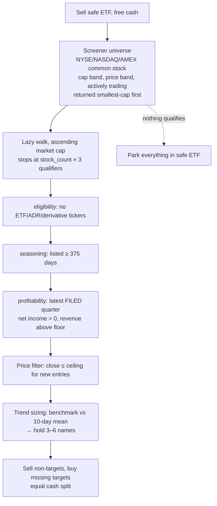

# trading-script-anatomy

**English** | [简体中文](README.zh-CN.md)

An educational anatomy of taking a Chinese A-share quant script and rebuilding it
as a testable, US-market trading system.

The starting point ([`archive/国九条多因子微盘策略.py`](archive/国九条多因子微盘策略.py))
is a micro-cap rotation strategy written for the PTrade platform: a single file of
platform callbacks, global state, and mainland-China market rules. The end point is
a small Python package with swappable data providers and brokers, a US translation
of every market-specific rule, a point-in-time-aware backtester, and a live paper-trading
adapter — with tests at every seam.

**This is a learning project, not investment advice.** The strategy's edge is
unproven in US markets; the first honest backtest (see below) mostly demonstrates
how much spreads and stop-loss whipsaw cost.

## The strategy in one paragraph

Hold a small rotating basket (3–6 names) of the *smallest* investable, profitable
companies, refreshed weekly, on the thesis that a persistent size premium exists at
the bottom of the market. Exit any position at +100% or −9%. If the whole market
lurches (benchmark intraday move ≥ threshold), liquidate everything. Whenever the
strategy holds no equity conviction — nothing qualified, or a stop just fired —
park all cash in a T-bill ETF rather than earning nothing.

## System logic

Weekly, on the configured rebalance day (`StrategyEngine.weekly_rebalance`):



Daily:

- `before_trading_start` — reset the day's flags.
- `risk_check` — per-position exits (stop-profit +100%, stop-loss −9% from cost)
  and the market-wide stop (liquidate all if |benchmark open→close| ≥ threshold).
- `handle_data` (after 14:00) — if a risk exit fired, sweep proceeds into the safe ETF.

The engine never schedules itself and never reads a clock: every method takes
`as_of`/`now` from the caller. That single decision is what lets the same engine be
driven by a live scheduler, a paper loop, or the backtest calendar.

## What was adapted from the original, and how

Every A-share rule was translated by its *economic purpose*, not its letter:

| Original (A-share / PTrade) | US port | Why |
|---|---|---|
| Universe: SZSE Composite constituents (`get_index_stocks`) | FMP company screener: exchange, cap band, price band, actively-trading | No free "index constituents as of date" exists for US; the screen *is* the universe, and it returns market caps — enabling the lazy selection walk |
| Benchmark `399101.XSHE` (SZSE Composite) | `^RUT` (Russell 2000 index) | Comparable role; index bars are free-tier accessible where ETF bars (IWM) are gated; similar point magnitude keeps the point-based trend bands meaningful |
| Safe ETF `511880.SS` (CNY money market) | `SGOV` (0–3 month T-bills) | Same job: monetize parked cash. Only ordered through the broker, so FMP's ETF-bar gating doesn't affect live use |
| ST / `退` name filters, board-prefix exclusions (`30/68/8/4`) | `us_eligibility`: no ADRs, ETFs, inactive listings, off-exchange venues, warrant/unit/right tickers; $2 screener price floor | The `'ST' in name` check would wrongly exclude half the US market ("FirstEnergy"). The US analogs of "risky junk": penny stocks, derivatives-as-tickers, OTC. SPACs need no rule — the revenue/profit floors exclude shells structurally |
| Price-limit rules: limit-up tail check, limit-up sell restriction, `high_limit`/`low_limit` filters | Deleted (holding machinery) / self-disabling (candidate filter) | US equities have no daily price limits; the entire tail-check lifecycle managed mechanics that don't exist here |
| Empty months (Jan/Apr) | Dropped (`empty_months=()`) | That was A-share disclosure-season seasonality; US small-cap seasonality is historically the opposite |
| Cap band ¥1B–10B | $50M–$500M | Preserves the *market role* (smallest investable decile), not the currency conversion (~$140M–$1.4B would be small-cap, diluting the premise) |
| Revenue floor ¥100M vs YTD statements | $5M per quarter | Chinese statements are year-to-date, so the original floor's strictness varied by season (≈$3.5M–$14M/quarter); a single-quarter floor holds it constant |
| Market stop: mean intraday return of *all* constituents ≥ 5% | Benchmark's own intraday return ≥ 4% | One API call instead of hundreds per day; threshold lowered because an uncapped market makes the same mean move rarer |
| Trend bands ±200/±500 SZSE points | ±290/±725 ^RUT points | Same percentage thresholds at each index's level. Point-based bands decay as the index drifts — a percentage-based rule is the acknowledged durable fix |
| Fundamentals: latest published report (`get_fundamentals`) | Latest quarterly statement **filed** on or before the evaluation date | FMP exposes filing dates, making the profitability filter point-in-time correct — the original platform's "latest published" semantics, honored explicitly |
| Commissions + stamp tax + slippage (platform-configured) | `CostModel` (per-fill slippage, commission, sell tax) in the backtest broker | US reality: zero commission but micro-cap spreads of 0.5–2% — modeled as slippage, and the thing most likely to kill this strategy in the US |

## Architecture

Ports-and-adapters: the strategy core depends only on protocols; vendors plug in.

```
src/trading_script_anatomy/
├── config.py                 StrategyConfig + us_strategy_config() preset
├── engine.py                 StrategyEngine — the PTrade lifecycle, scheduler-agnostic
├── portfolio.py              Portfolio / Position models
├── values.py, env.py         shared coercion helpers, explicit .env loading
├── data/
│   ├── protocols.py          BarProvider, MarketDataProvider, IndexUniverseProvider,
│   │                         RankedUniverseProvider (capability protocol)
│   ├── models.py             SecurityInfo, ProfitabilitySnapshot, FinancialSnapshot,
│   │                         RankedSecurity
│   ├── fmp_provider.py       FMP client + market data + screener universe
│   ├── yfinance_provider.py  alternative adapter (warns: fundamentals not point-in-time)
│   └── universe.py           static universe for tests/research
├── strategy/
│   ├── selection.py          StockSelector — dual funnel (lazy ranked walk / exhaustive)
│   ├── us_filters.py         US eligibility rules
│   ├── cn_filters.py         A-share eligibility rules (the legacy default)
│   ├── risk.py               RiskManager — position exits + market stop
│   └── state.py              StrategyState (the legacy global `g`, made explicit)
├── broker/
│   ├── protocols.py          Broker port
│   ├── memory.py             InMemoryBroker — deterministic fills + CostModel
│   └── alpaca.py             Alpaca paper/live adapter (awaited fills, audit ids)
└── backtest/
    └── simulator.py          Backtester, BacktestResult, DelayedMarketData
```

Design decisions worth noticing:

- **Capability negotiation:** universe providers that can rank cheaply (the screener)
  advertise `ranked_constituents`; the selector detects it and walks lazily, stopping
  after `stock_count × 3` qualifiers (~50 API calls per rebalance instead of ~3,000).
  Providers that can't rank fall back to the original exhaustive funnel.
- **Point-in-time as a named contract:** `financial_snapshot`/`profitability` must
  only report values published on or before `as_of`. FMP honors it via filing dates;
  yfinance can't, says so, and warns at runtime.
- **The backtest clock split (`DelayedMarketData`):** on day D the *strategy* sees
  bars through D−1 (matching live end-of-day reality) while the *driver* fills at
  D's open + slippage and marks equity at D's close. Strategy and market must not
  share a clock.
- **Self-healing execution:** the engine never trusts its memory of holdings — every
  cycle re-reads broker state, so a mid-rebalance crash converges instead of corrupting.

## Data sources and plan gates

| Capability | FMP free | FMP Starter | Notes |
|---|---|---|---|
| Daily bars: stocks, `^RUT`, SPY | ✅ | ✅ | Most ETF symbols (IWM, SGOV, BIL…) are gated on free |
| Company profiles | ✅ | ✅ | |
| Quarterly income statements | ✅ (`limit` ≤ 5) | ✅ deeper | Filing dates included → point-in-time correct |
| Company screener (the universe) | ❌ 402 | ✅ | The one hard gate on running the real strategy |
| Historical market caps, delisted companies | ❌ | partially / higher tiers | Needed for honest long-window backtests |

Execution: Alpaca paper trading (`APCA_API_KEY_ID`/`APCA_API_SECRET_KEY` in `.env`).
Note: regenerating Alpaca keys keeps the key ID and rotates only the secret, and
resetting a paper account invalidates its keys entirely.

## Running it

```bash
uv sync                                    # install
cp .env.example .env                       # or create .env with:
                                           #   FMP_API_KEY=...
                                           #   APCA_API_KEY_ID=...
                                           #   APCA_API_SECRET_KEY=...
uv run pytest                              # 66 tests, no network needed
uv run python examples/check_fmp.py        # FMP data layer against live API
uv run python examples/check_alpaca.py     # Alpaca paper account (orders if market open)
uv run python examples/demo_backtest.py    # one-month backtest on real prices (~100 API calls)
```

The backtest demo uses real prices and real filed fundamentals, but a demo
universe (five large caps standing in for the gated screener) and SPY standing in
for SGOV — so it validates machinery, not strategy performance. Its actual lesson:
in a flat month, 0.5% spreads plus −9% stop-loss whipsaw cost ~6.7%.

## Roadmap

Done:

- [x] Modular port of the PTrade script (engine / selection / risk / state / broker / data)
- [x] US market translation of every A-share rule, each decision documented in code
- [x] FMP adapter (point-in-time statements) + screener universe; yfinance alternative
- [x] Lazy ranked selection funnel (60× fewer API calls per rebalance)
- [x] Market stop rewritten benchmark-based (1 call/day instead of N)
- [x] Limit-up machinery removed; A-share rules preserved behind the eligibility seam
- [x] Alpaca paper-trading broker (awaited fills, snapshot caching, auditable order ids)
- [x] DRY/SOLID pass (profitability/market-value split, BarProvider, shared helpers)
- [x] Backtester: cost models, EOD visibility shift, metrics; validated on live data

Next, roughly in order:

- [ ] **Live order-path validation** — run `check_alpaca.py` during US market hours
- [ ] **Runner/scheduler** — trading-calendar-aware daily loop (Alpaca clock, ET times),
      `.env` loading, logging config, `StrategyState` persistence between runs
- [ ] **FMP Starter upgrade** — unlocks the screener; the real micro-cap universe goes
      live in both the weekly selection and the backtest with zero code changes
- [ ] **Backtest fidelity** — per-symbol cost model (micro-cap vs ETF spreads),
      SGOV leg once un-gated, historical market caps + delisted companies for
      survivorship-honest long windows
- [ ] **Operational hardening** — decision/audit log, failure notifications, retry
      policy, periodic expected-vs-actual holdings reconciliation
- [ ] **Strategy experiments** (after infrastructure) — percentage-based trend bands,
      SGOV-vs-SPY parking comparison, cap-band and stop-parameter sensitivity

## License

See [LICENSE](LICENSE).
