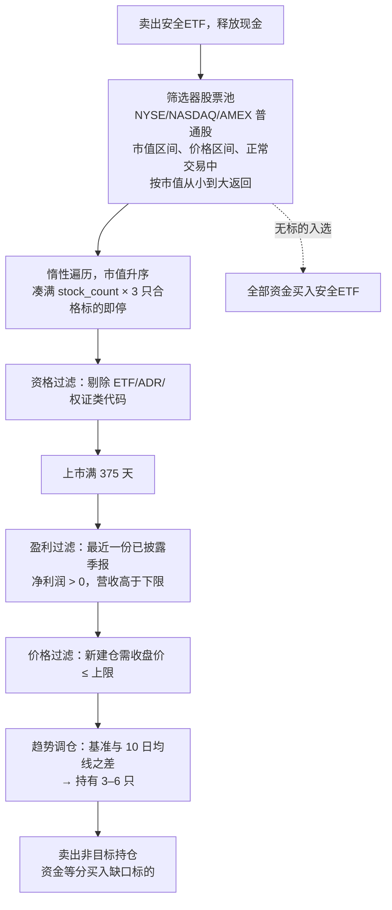

# trading-script-anatomy

[English](README.md) | **简体中文**

一个教学项目：解剖一份 A 股量化脚本，并把它重建为可测试、面向美股市场的交易系统。

起点是 [`archive/国九条多因子微盘策略.py`](archive/国九条多因子微盘策略.py)——
一个为 PTrade 平台编写的微盘股轮动策略：单文件、平台回调、全局状态，外加一整套
A 股特有的市场规则。终点是一个小型 Python 包：数据源与券商均可插拔、每条市场
规则都完成了美股化改写、回测引擎支持时点数据（point-in-time，防未来函数）、
并带有对接实盘/模拟盘的券商适配器——每一处模块边界都有测试覆盖。

**这是一个学习项目，不构成投资建议。** 策略在美股市场是否有效尚未验证；
第一次严谨的回测（见下文）主要说明的，反而是点差与止损反复被扫（whipsaw）
的成本有多高。

## 一段话说清策略逻辑

持有 3–6 只**市值最小**且有真实盈利的股票，每周轮动一次——背后的逻辑是：
市值分布的最末端存在持续的小市值溢价。个股 +100% 止盈、−9% 止损。若市场整体
剧烈波动（基准指数日内涨跌幅达到阈值），全部清仓。当策略无股可持时——选不出
标的，或刚刚触发止损——就把全部现金停泊到短期国债 ETF 里生息，而不是闲置。

## 系统逻辑

每周（在配置的调仓日，`StrategyEngine.weekly_rebalance`）：



每日：

- `before_trading_start` —— 重置当日状态标志。
- `risk_check` —— 个股止盈止损（+100% 止盈、较成本价 −9% 止损），以及市场
  止损（基准指数开盘到收盘的绝对涨跌幅 ≥ 阈值则全部清仓）。
- `handle_data`（14:00 之后）—— 若当日触发过风控卖出，把释放的资金转入安全 ETF。

引擎从不自行调度、从不读取时钟：每个方法的 `as_of`/`now` 全部由调用方传入。
正是这一设计，让同一套引擎既能被实盘调度器驱动，也能跑模拟盘循环，
还能被回测日历驱动。

## 相对原脚本改了什么、怎么改的

每条 A 股规则都按其**经济目的**改写，而非照搬字面：

| 原版（A 股 / PTrade） | 美股版 | 原因 |
|---|---|---|
| 股票池：深证综指成分股（`get_index_stocks`） | FMP 股票筛选器：交易所、市值区间、价格区间、正常交易 | 美股没有免费的"某日指数成分股"数据；筛选结果**就是**股票池，且自带市值——惰性选股遍历因此成为可能 |
| 基准 `399101.XSHE`（深证综指） | `^RUT`（罗素2000指数） | 角色相当；指数行情在免费版可用而 ETF（IWM）被限制；点位量级相近，按点数定义的趋势区间仍有意义 |
| 安全 ETF `511880.SS`（银华日利，货币基金） | `SGOV`（0–3 个月美国国债） | 职责相同：让停泊资金生息。该标的只经券商下单，FMP 对 ETF 行情的限制不影响实盘 |
| ST / 退市名称过滤，板块前缀排除（`30/68/8/4`） | `us_eligibility`：剔除 ADR、ETF、已停止交易、场外（OTC）、权证（warrant）与 SPAC 单位（unit）等衍生类代码；筛选器 $2 价格下限 | `'ST' in name` 会错杀半个美股市场（比如 "FirstEnergy"）。美股版的"高风险垃圾"是仙股、衍生类代码和 OTC。SPAC 无需专门规则——营收与利润下限从结构上就排除了壳公司 |
| 涨跌停规则：涨停尾盘检查、涨停股暂缓卖出、`high_limit`/`low_limit` 过滤 | 删除（持仓管理机制）/ 自动失效（候选过滤） | 美股没有每日涨跌停板；整套尾盘涨停检查所管理的机制在美股根本不存在 |
| 空仓月份（1 月/4 月） | 取消（`empty_months=()`） | 那是 A 股财报披露季的季节性效应；美股小盘股的季节性在历史上恰好相反 |
| 市值区间 ¥10亿–100亿 | $5000万–$5亿 | 保留其**市场角色**（可投资范围内市值最小的一档），而非做货币换算（约 $1.4亿–$14亿 会落到小盘股区间，偏离微盘股的前提） |
| 营收下限 ¥1亿（对年初累计口径报表） | 单季 $500万 | 中国利润表为年初累计口径，原下限的实际严格程度随披露季节波动（约合每季 $350万–$1400万）；改用单季口径后标准全年一致 |
| 市场止损：**全部**成分股日内涨跌幅均值 ≥ 5% | 基准指数自身日内涨跌幅 ≥ 4% | 每天 1 次 API 调用替代数百次；没有涨跌停约束的市场里，同样幅度的均值波动更罕见，故阈值调低 |
| 趋势区间 ±200/±500 深综指点 | ±290/±725 ^RUT 点 | 在各自指数点位上对应相同的百分比阈值。按点数定义的区间会随指数漂移而失真——按百分比定义才是长久之计（已在代码注释中说明） |
| 基本面：最新已发布报告（`get_fundamentals`） | 评估日或之前**已披露（filed）**的最新季报 | FMP 提供披露日期，使盈利过滤具备时点正确性、杜绝未来函数——相当于把原平台"最新已发布"的语义做成了显式实现 |
| 佣金 + 印花税 + 滑点（平台配置） | 回测券商中的 `CostModel`（滑点、佣金、卖出税） | 美股的现实：零佣金，但微盘股点差高达 0.5–2%——以滑点建模，这也是该策略在美股最可能的死因 |

## 架构

端口与适配器（Ports & Adapters，即六边形架构）：策略核心只依赖协议
（Protocol），数据源即插即用。

```
src/trading_script_anatomy/
├── config.py                 StrategyConfig + us_strategy_config() 美股预设
├── engine.py                 StrategyEngine —— 替代 PTrade 回调生命周期，与调度方式解耦
├── portfolio.py              Portfolio / Position 模型
├── values.py, env.py         共享类型转换工具、显式 .env 加载
├── data/
│   ├── protocols.py          BarProvider、MarketDataProvider、IndexUniverseProvider、
│   │                         RankedUniverseProvider（能力协议）
│   ├── models.py             SecurityInfo、ProfitabilitySnapshot、FinancialSnapshot、
│   │                         RankedSecurity
│   ├── fmp_provider.py       FMP 客户端 + 行情/基本面 + 筛选器股票池
│   ├── yfinance_provider.py  备选适配器（会警告：基本面非时点数据）
│   └── universe.py           静态股票池，用于测试/研究
├── strategy/
│   ├── selection.py          StockSelector —— 双路径漏斗（惰性排序遍历 / 全量遍历）
│   ├── us_filters.py         美股资格规则
│   ├── cn_filters.py         A 股资格规则（保留的默认实现）
│   ├── risk.py               RiskManager —— 个股止盈止损 + 市场止损
│   └── state.py              StrategyState（原全局变量 `g` 的显式化）
├── broker/
│   ├── protocols.py          Broker 端口
│   ├── memory.py             InMemoryBroker —— 确定性成交 + CostModel
│   └── alpaca.py             Alpaca 模拟盘/实盘适配器（等待成交、可审计订单号）
└── backtest/
    └── simulator.py          Backtester、BacktestResult、DelayedMarketData
```

几个值得注意的设计决定：

- **能力协商：** 能够低成本给出市值排序的股票池数据源（筛选器）会声明
  `ranked_constituents`；选股器检测到该能力后，按市值从小到大惰性遍历，凑满
  `stock_count × 3` 只合格标的即停（单次调仓约 50 次 API 调用，而非约 3,000 次）。
  不具备排序能力的数据源自动回退到原版全量漏斗。
- **把时点要求写成显式契约：** `financial_snapshot`/`profitability` 只允许返回
  `as_of` 当日或之前已披露的数值，否则回测就引入了未来函数。FMP 通过披露日期
  履约；yfinance 做不到，于是在文档中如实声明，并在运行时发出警告。
- **回测的时钟分离（`DelayedMarketData`）：** 第 D 日，**策略**只能看到 D−1 及
  之前的 K 线（与实盘只能拿到前一日 EOD 数据的现实一致），而**回测驱动**以
  D 日开盘价加滑点撮合成交、以 D 日收盘价核算净值。策略与市场不得共用同一个时钟。
- **自愈式执行：** 引擎从不信任自己对持仓的记忆——每个周期都从券商重新读取
  真实状态。调仓中途崩溃后，下一次运行会自动向目标收敛，不会损坏账户状态。

## 数据源与套餐限制

| 能力 | FMP 免费版 | FMP Starter | 备注 |
|---|---|---|---|
| 日线：个股、`^RUT`、SPY | ✅ | ✅ | 多数 ETF 代码（IWM、SGOV、BIL…）在免费版被限制 |
| 公司概况（profile） | ✅ | ✅ | |
| 季度利润表 | ✅（`limit` ≤ 5） | ✅ 历史更深 | 含披露日期 → 具备时点正确性 |
| 股票筛选器（股票池来源） | ❌ 402 | ✅ | 运行真实策略的唯一硬性门槛 |
| 历史市值、退市公司 | ❌ | 部分 / 更高套餐 | 做长周期可信回测的必要条件 |

执行端：Alpaca 模拟盘（在 `.env` 中配置 `APCA_API_KEY_ID`/`APCA_API_SECRET_KEY`）。
注意：Alpaca 重新生成密钥时 Key ID 不变、只轮换 Secret；重置模拟盘账户则会让
原有密钥整体失效。

## 运行

```bash
uv sync                                    # 安装依赖
cp .env.example .env                       # 或手动创建 .env：
                                           #   FMP_API_KEY=...
                                           #   APCA_API_KEY_ID=...
                                           #   APCA_API_SECRET_KEY=...
uv run pytest                              # 66 个测试，无需联网
uv run python examples/check_fmp.py        # 检查 FMP 数据层连通性与套餐权限
uv run python examples/check_alpaca.py     # 检查 Alpaca 模拟盘（盘中运行会真实下单）
uv run python examples/demo_backtest.py    # 一个月真实行情回测（约 100 次 API 调用）
```

回测演示用的是真实价格和真实披露的财报，但股票池是演示性质的（五只大盘股
替代被限制的筛选器）、并以 SPY 暂代 SGOV——所以它验证的是整套流程能跑通，
而不是策略本身的表现。它真正说明的问题是：在一个横盘月份里，0.5% 的点差
加上 −9% 止损反复被扫，成本约 6.7%。

## 路线图

已完成：

- [x] PTrade 脚本的模块化移植（engine / selection / risk / state / broker / data）
- [x] 每条 A 股规则的美股化改写，决策理由全部写进代码
- [x] FMP 适配器（时点财报）+ 筛选器股票池；yfinance 备选
- [x] 惰性排序选股漏斗（单次调仓 API 调用量降至约 1/60）
- [x] 市场止损改为基于基准指数（每日 1 次调用替代 N 次）
- [x] 移除涨跌停机制；A 股规则保留在可插拔的资格过滤接口之后
- [x] Alpaca 模拟盘券商适配器（等待成交、快照缓存、可审计订单号）
- [x] DRY/SOLID 重构（盈利/市值拆分、BarProvider、共享工具）
- [x] 回测引擎：成本模型、EOD 数据可见性延迟（防未来函数）、绩效指标；
      已用真实行情验证

接下来，大致按顺序：

- [ ] **实盘下单链路验证** —— 美股盘中运行 `check_alpaca.py`
- [ ] **运行器/调度器** —— 按交易日历驱动的每日循环（Alpaca 时钟、美东时间）、
      `.env` 加载、日志配置、`StrategyState` 跨次运行持久化
- [ ] **升级 FMP Starter** —— 解锁筛选器；零代码改动即可让真实微盘股票池
      同时用于选股与回测
- [ ] **回测保真度** —— 按标的区分的成本模型（微盘股与 ETF 点差差异巨大）、
      解锁后恢复 SGOV 停泊仓位、引入历史市值与退市公司数据以消除幸存者偏差
- [ ] **运维加固** —— 决策/审计日志、失败通知、重试策略、预期与实际持仓的
      定期对账
- [ ] **策略实验**（基础设施完成之后）—— 按百分比定义的趋势区间、SGOV 与
      SPY 停泊对比、市值区间与止损参数的敏感性分析

## 许可证

见 [LICENSE](LICENSE)。
