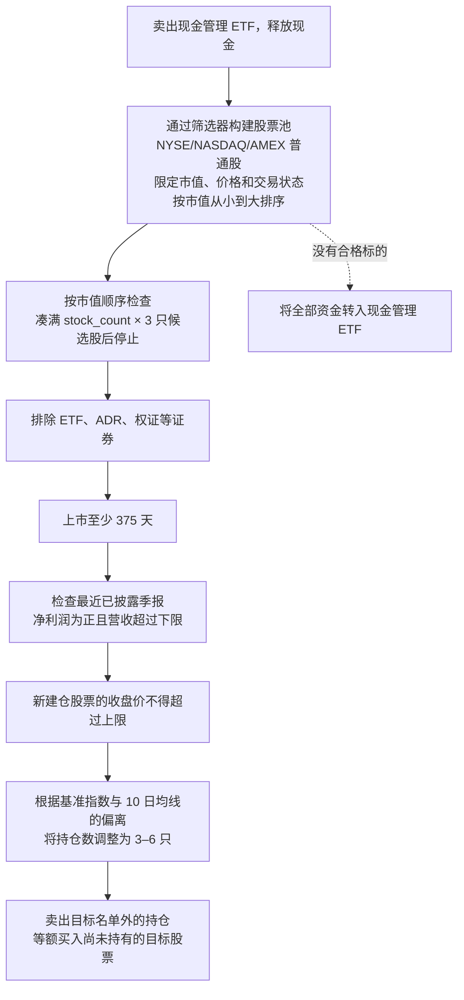

# trading-script-anatomy

[English](README.md) | **简体中文**

一个教学项目：从拆解一份 A 股量化脚本开始，将其重构为一套可测试的美股交易系统。

项目以 [`archive/国九条多因子微盘策略.py`](archive/国九条多因子微盘策略.py)
为原型。这是一套为 PTrade 平台编写的微盘股轮动策略，所有平台回调、全局状态和
A 股市场规则都集中在一个文件里。本项目最终将它重构成一个小型 Python 包：数据源
和券商实现可以替换，各项规则根据美股市场特点重新设计，回测引擎强调时点一致性
（point-in-time，避免未来函数），并提供可接入实盘或模拟盘的券商适配器。所有模块
边界均有测试覆盖。

**这是一个学习项目，不构成投资建议。** 策略在美股市场是否有效尚未验证。
首轮严格回测（见下文）反倒揭示了点差和反复触发止损（whipsaw）带来的高昂成本。

## 一段话说清策略逻辑

持有 3–6 只**市值最小**且已经实现盈利的股票，每周轮动一次。策略的基本假设是：
市值最小的一端可能长期存在规模溢价。个股上涨 100% 时止盈、较成本价下跌 9% 时
止损；若市场整体剧烈波动（基准指数日内涨跌幅达到阈值），则全部清仓。没有合适
的股票可持有时——例如选不出标的或刚刚触发止损——就将现金转入短期国债 ETF，
获取短债收益。

## 系统逻辑

每周（在配置的调仓日，`StrategyEngine.weekly_rebalance`）：



每日：

- `before_trading_start` —— 重置当日状态标志。
- `risk_check` —— 个股止盈止损（+100% 止盈、较成本价 −9% 止损），以及市场
  止损（基准指数开盘到收盘的绝对涨跌幅 ≥ 阈值则全部清仓）。
- `handle_data`（14:00 之后）—— 若当日因风控卖出持仓，将释放的资金转入现金管理 ETF。

引擎不自行调度，也不主动读取系统时间：每个方法的 `as_of`/`now` 全部由调用方传入。
正是这一设计，让同一套引擎既能被实盘调度器驱动，也能跑模拟盘循环，
还能被回测日历驱动。

## 相对原脚本改了什么、怎么改的

每条 A 股规则都按其**经济目的**改写，而非照搬字面：

| 原版（A 股 / PTrade） | 美股版 | 原因 |
|---|---|---|
| 股票池：深证综指成分股（`get_index_stocks`） | FMP 股票筛选器：交易所、市值区间、价格区间、正常交易 | 美股市场缺少免费且支持历史时点查询的指数成分股数据。筛选结果直接作为股票池，并自带市值，因此可以按市值顺序检查候选股 |
| 基准 `399101.XSHE`（深证综指） | `^RUT`（罗素 2000 指数） | 用途相近；免费版可以获取指数行情，但 ETF（IWM）行情受限；二者点位量级接近，按点数划分的趋势区间仍有参考意义 |
| 现金管理 ETF `511880.SS`（银华日利，货币基金） | `SGOV`（0–3 个月美国国债） | 作用相同：让闲置资金获取收益。策略只通过券商交易该标的，因此 FMP 对 ETF 行情的限制不影响实盘 |
| ST / 退市名称过滤，板块前缀排除（`30/68/8/4`） | `us_eligibility`：剔除 ADR、ETF、已停止交易、场外（OTC）、权证（warrant）与 SPAC 单位（unit）等衍生类代码；筛选器设置 2 美元价格下限 | `'ST' in name` 会把 FirstEnergy 等普通公司误判为 ST。美股市场中需要排除的主要是仙股、OTC 股票，以及权证、SPAC 单位等衍生证券。SPAC 无需单独处理，营收与利润下限会自然排除空壳公司 |
| 涨跌停规则：涨停尾盘检查、涨停股暂缓卖出、`high_limit`/`low_limit` 过滤 | 删除持仓侧逻辑；候选过滤在缺少涨跌停字段时自动跳过 | 美股没有每日涨跌停板，因此不需要原脚本中围绕涨跌停设计的整套持仓管理机制 |
| 空仓月份（1 月/4 月） | 取消（`empty_months=()`） | 那是 A 股财报披露季的季节性效应；美股小盘股的季节性在历史上恰好相反 |
| 市值区间 10亿–100亿元人民币 | 5,000 万–5 亿美元 | 保留原策略的**市场定位**，即投资于可交易范围内市值最小的一档，而不是直接换算币值；直接换算约为 1.4 亿–14 亿美元，会进入小盘股区间，偏离微盘股策略的前提 |
| 营收下限 1 亿元人民币（基于年初至今累计口径） | 单季 500 万美元 | 中国利润表采用年初至今累计口径，因此原下限的严格程度会随披露季度变化，约合每季 350 万–1,400 万美元；改用单季口径后，全年标准保持一致 |
| 市场止损：**全部**成分股日内涨跌幅均值 ≥ 5% | 基准指数自身日内涨跌幅 ≥ 4% | 用每天一次 API 调用取代数百次调用；在没有涨跌停限制的市场中，同等幅度的平均波动更为罕见，因此将阈值下调 |
| 趋势区间 ±200/±500 深综指点 | ±290/±725 ^RUT 点 | 两组点数在各自指数点位上对应相近的百分比阈值。随着指数中枢变化，固定点数区间会逐渐失真；改用百分比会更稳健（代码注释中已说明） |
| 基本面：最新已发布报告（`get_fundamentals`） | 评估日或之前**已经披露（filed）**的最新季报 | FMP 提供报告披露日期，因此盈利过滤只会使用当时已经公开的数据，避免引入未来函数，也明确实现了原平台“最新已发布”的语义 |
| 佣金 + 印花税 + 滑点（平台配置） | 回测券商中的 `CostModel`（滑点、佣金、卖出税） | 美股虽然普遍零佣金，但微盘股点差可达 0.5–2%。回测用滑点对其建模，这也是最可能侵蚀策略收益的成本之一 |

## 架构

项目采用端口与适配器架构（Ports & Adapters，也称六边形架构）：策略核心只依赖
协议（Protocol），数据源和券商实现都可以替换。

```
src/trading_script_anatomy/
├── config.py                 StrategyConfig + us_strategy_config() 美股预设
├── engine.py                 StrategyEngine —— 替代 PTrade 回调生命周期，与调度方式解耦
├── portfolio.py              Portfolio / Position 模型
├── values.py, env.py         共享类型转换工具、显式 .env 加载
├── data/
│   ├── protocols.py          BarProvider、MarketDataProvider、IndexUniverseProvider、
│   │                         RankedUniverseProvider（可选能力协议）
│   ├── models.py             SecurityInfo、ProfitabilitySnapshot、FinancialSnapshot、
│   │                         RankedSecurity
│   ├── fmp_provider.py       FMP 客户端 + 行情/基本面 + 筛选器股票池
│   ├── yfinance_provider.py  备选适配器（会警告：基本面非时点数据）
│   └── universe.py           静态股票池，用于测试/研究
├── strategy/
│   ├── selection.py          StockSelector —— 双路径筛选（按需排序遍历 / 全量遍历）
│   ├── us_filters.py         美股资格规则
│   ├── cn_filters.py         A 股资格规则（保留的默认实现）
│   ├── risk.py               RiskManager —— 个股止盈止损 + 市场止损
│   └── state.py              StrategyState（用显式状态取代原全局变量 `g`）
├── broker/
│   ├── protocols.py          Broker 端口
│   ├── memory.py             InMemoryBroker —— 确定性撮合 + CostModel
│   └── alpaca.py             Alpaca 模拟盘/实盘适配器（同步等待成交、可追溯订单编号）
└── backtest/
    └── simulator.py          Backtester、BacktestResult、DelayedMarketData
```

几个值得注意的设计决定：

- **按数据源能力选择执行路径：** 能够低成本提供市值排序结果的数据源（如筛选器）
  会实现 `ranked_constituents`。选股器检测到这一能力后，按市值从小到大检查候选股，
  凑满 `stock_count × 3` 只便停止，单次调仓约需 50 次 API 调用，而不是约 3,000 次。
  如果数据源不具备排序能力，则自动回退到原版的全量筛选流程。
- **将时点一致性写入接口契约：** `financial_snapshot`/`profitability` 中用于盈利
  筛选的财报数值，只能来自 `as_of` 当日或之前已经披露的报告，否则回测就会引入
  未来函数。FMP 可以按披露日期筛选报告；yfinance 无法做到，因此会在历史查询时
  发出警告。
- **隔离策略数据与撮合数据的时间切面（`DelayedMarketData`）：** 在第 D 个交易日，
  **策略**只能看到 D−1 日及之前的 K 线，符合实盘只能使用前一日收盘数据的情况；
  **回测驱动**则以 D 日开盘价加滑点成交，并以 D 日收盘价计算净值。策略可见行情
  与回测撮合行情不能使用同一个时间切面。
- **故障后自动收敛：** 引擎每轮都会从券商重新读取持仓，不依赖本地保存的持仓快照。
  即使调仓中途崩溃，下一次运行也会继续向目标持仓收敛，不会让账户状态失去同步。

## 数据源与套餐限制

| 能力 | FMP 免费版 | FMP Starter | 备注 |
|---|---|---|---|
| 日线：个股、`^RUT`、SPY | ✅ | ✅ | 多数 ETF 代码（IWM、SGOV、BIL…）在免费版被限制 |
| 公司概况（profile） | ✅ | ✅ | |
| 季度利润表 | ✅（`limit` ≤ 5） | ✅ 历史更深 | 含披露日期，可保证财报数据的时点一致性 |
| 股票筛选器（股票池来源） | ❌ 402 | ✅ | 按真实股票池运行策略的唯一硬性门槛 |
| 历史市值、退市公司 | ❌ | 部分 / 更高套餐 | 进行可信长期回测的必要条件 |

执行端：Alpaca 模拟盘（在 `.env` 中配置 `APCA_API_KEY_ID`/`APCA_API_SECRET_KEY`）。
注意：Alpaca 重新生成密钥时 Key ID 不变、只轮换 Secret；重置模拟盘账户则会让
原有密钥整体失效。

## 运行

```bash
uv sync                                    # 安装依赖
cp .env.example .env                       # 或手动创建 .env：
                                           #   FMP_API_KEY=...
                                           #   APCA_API_KEY_ID=...
                                           #   APCA_API_SECRET_KEY=...
uv run pytest                              # 66 个测试，无需联网
uv run python examples/check_fmp.py        # 检查 FMP 数据层连通性与套餐权限
uv run python examples/check_alpaca.py     # 检查 Alpaca 模拟盘（盘中会提交模拟盘订单）
uv run python examples/demo_backtest.py    # 一个月真实行情回测（约 100 次 API 调用）
```

回测演示使用真实行情和当时已经披露的财报，但受免费版限制，股票池由五只大盘股
代替真实筛选结果，现金管理标的也以 SPY 暂代 SGOV。因此，这个演示只能验证整套
流程能否跑通，不能说明策略本身的表现。结果显示，在一个横盘月份里，0.5% 的点差
加上反复触发 −9% 止损，最终造成了约 6.7% 的损耗。

## 路线图

已完成：

- [x] PTrade 脚本的模块化移植（engine / selection / risk / state / broker / data）
- [x] 根据美股市场特点改写每项 A 股规则，决策理由全部写进代码
- [x] FMP 适配器（按披露时点筛选财报）+ 筛选器股票池；yfinance 备选
- [x] 按市值顺序检查候选股（单次调仓 API 调用量降至约 1/60）
- [x] 市场止损改为基于基准指数（每日 1 次调用替代 N 次）
- [x] 移除涨跌停机制；A 股规则保留在可插拔的资格过滤接口之后
- [x] Alpaca 模拟盘券商适配器（同步等待成交、快照缓存、可追溯订单编号）
- [x] DRY/SOLID 重构（盈利/市值拆分、BarProvider、共享工具）
- [x] 回测引擎：成本模型、策略只能看到前一交易日收盘数据（防未来函数）、绩效指标；
      已用真实行情验证

接下来，大致按顺序：

- [ ] **下单链路验证** —— 美股盘中运行 `check_alpaca.py`
- [ ] **运行器/调度器** —— 按交易日历驱动的每日循环（Alpaca 时钟、美东时间）、
      `.env` 加载、日志配置、在多次运行之间持久化 `StrategyState`
- [ ] **升级 FMP Starter** —— 解锁筛选器；无需改代码即可让真实微盘股票池
      同时用于选股与回测
- [ ] **提高回测真实性** —— 针对不同标的设置不同成本参数（微盘股与 ETF 点差差异巨大）、
      解锁后恢复 SGOV 现金管理仓位、引入历史市值与退市公司数据以消除幸存者偏差
- [ ] **运维加固** —— 决策/审计日志、失败通知、重试策略、预期与实际持仓的
      定期对账
- [ ] **策略实验**（基础设施完善后）—— 按百分比定义的趋势区间、对比使用 SGOV
      和 SPY 管理闲置资金的效果、市值区间与止损参数的敏感性分析

## 许可

见 [LICENSE](LICENSE)。
